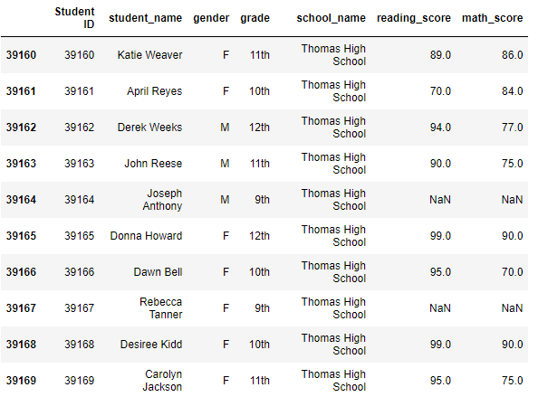
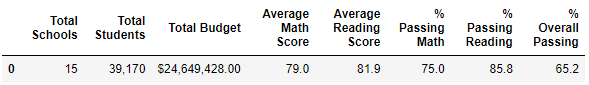
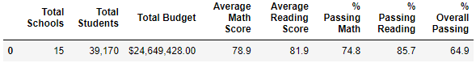
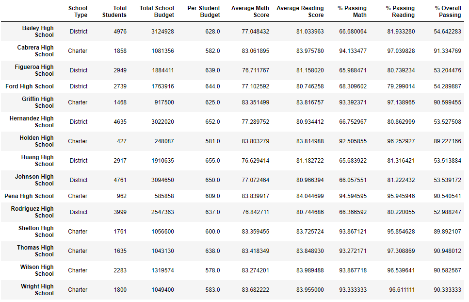
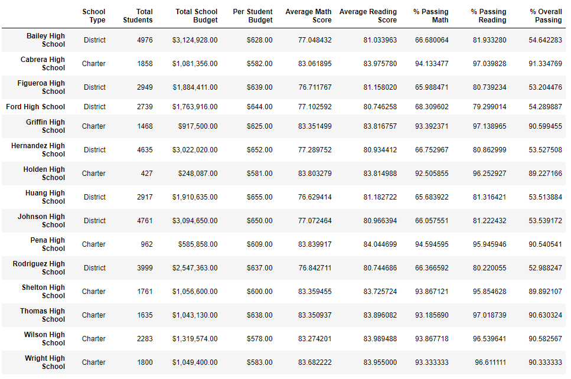
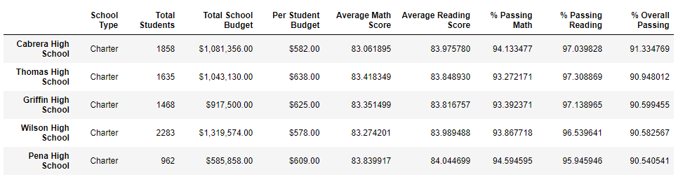
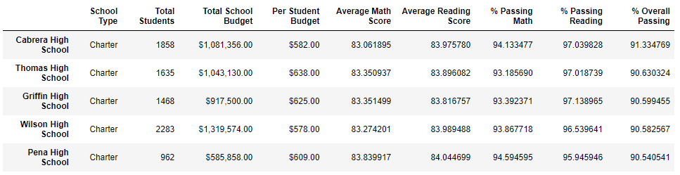

# School_District_Analysis
Module 4

## Overview of the School District Analysis
The purpose of developing the district-level analysis of math and reading standardized test scores for all students across the 15 high schools in the district was to provide key decision-makers with key performance trends and patterns based on school and/or student characteristics that may help drive future decision-making when allocating school funding in the future. With a limited budget, it is important that dollars spent are allocated as efficiently as possible, while also ensuring that particular groups of students of need receive additional support to raise overall standardized test scores.

Upon final analysis of the data, it is clear that both math and reading scores for the 9th grade students at Thomas High School appear to have been altered, rendering their scores unusable in a validated dataset. **The specific objective of the challenge analysis was to remove the 9th grade scores from Thomas High School for both math and meading so that updated student- and school-level data could be analyzed without the presence of inaccurate values.** In addition, comparisons between the original data and the corrected dataset should provide insight on the impact of the academically dishonest actions of the students and/or educators on the overall findings from this analysis.

To remove all the questionable data in the dataframe, it was important to change all Thomas High School 9th grade math and reading scores from the present values to "not a number". Setting the values to zero would have left the students in the dataset with inaccurate scores of 0 as opposed to being completely removed from the calculation of percent passing and average score. To perform this, the following code using the Pandas ```loc``` method was utilized to change all the relevant math and reading scores to "not a number"

```
  student_data_df.loc[(student_data_df["school_name"]==("Thomas High School")) & (student_data_df["grade"]==("9th")),  ["reading_score"]] = np.nan
  student_data_df.loc[(student_data_df["school_name"]==("Thomas High School")) & (student_data_df["grade"]==("9th")), ["math_score"]] = np.nan
  #student_data_df.tail(10)
```

The resulting output is represented in this dataframe, with "NaN" replacing the relevant values:


## Results
Removing the suspect scores from the Thomas High School 9th graders for both math and reading had a minor impact on the overall district results, though there were visible differences when looking at more granular data.

- How is the district summary affected?
  - The removal of the suspect scores dropped the district average math score by a tenth of a percent (79.0% to 78.9%) and had no measurable effect on the average reading score (81.9%). Small drops were seen in the percent of students passing the individual math and reading portions of the test, as well as a drop in the overall passing percentage for the district.
  - *Original District Summary*  
  
  - *Adjusted District Summary*   
    
  
- How is the school summary affected?
  - Only the scores in the Thomas High School are affected by the changes in the school summary. By removing the scores for the 9th grade studenes, a small decrease is seen in the average math scores, the percent of students passing the math portion of the test, the percent passing the reading portion of the test, and the overall percent of students passing both portions of the test. Average reading scores increased slightly with the removal of the 9th grade scores. Hit the books, kids.
  - *Original School Summary*  
  
  - *Adjusted School Summary*   
    
- How does replacing the ninth graders’ math and reading scores affect Thomas High School’s performance relative to the other schools?
  - Though there is a small drop in the percent of students passing both portions of the standardized test, Thomas High School's grip on the Number Two spot in the district is maintained with the adjusted scores. The drop from 90.95% passing overall to 90.63% passing overall is not substantial enough to dip below lowly Griffin High School in third place.
  - *Original Top Schools List*  
  
  - *Adjusted Top Schools List*   
    
- How does replacing the ninth-grade scores affect the following:
   - Math and reading scores by grade
      - The changes to math and reading scores by grade are minimally affected by the removal of the Thomas 9th grade student scores, as no other high schools, or the score for the 10th-12th grades at Thomas high school would have changed. Future analysis that looks at grade-level scores agnostic of high school could provide additional insight into the impact of the untrustworthy grades from Thomas High School's 9th graders.
   - Scores by school spending
      - 
   - Scores by school size
      - e
   - Scores by school type
      - f
